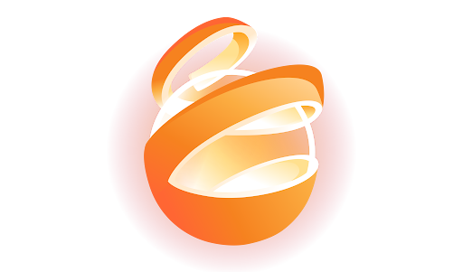

# 🚀 PyhgoShift: 차세대 AI AgentOps 플랫폼

> **"당신의 24/7 디지털 노동력(Digital Workforce) - 파이고시프트"**

파이고시프트(PyhgoShift)는 단순한 챗봇이 아닙니다. 클라우드플레어(Cloudflare) 인프라 위에서 24시간 깨어 있는 **에이전트 중심의 지능형 운영플랫폼(AgentOps)**입니다.

 *(로고 준비 중)*

---

## 🌟 주요 혁신 기능 (v9.0-BETA)

### 🧠 1. 멀티 모델 하이브리드 엔진 (NVIDIA NIM 연동)
이제 하나의 AI에 의존하지 않습니다. 상황에 따라 최적의 두뇌를 선택하세요.
- **Kimi-k2.5:** 문맥 이해와 긴 대화에 최적화된 메인 엔진.
- **Qwen-3.5:** 논리적 추론과 복잡한 문제 해결에 특화.
- **DeepSeek-V3.2:** 고성능 연산 및 명령 실행력 강화.

### 🔍 2. 실시간 '사고 과정(Thinking)' 시각화
AI가 단순히 답만 내놓는 것이 아니라, 어떤 고민과 전략을 세웠는지 **[THINKING]** 블록을 통해 투명하게 보여줍니다. 이로써 AI의 판단 근거를 사람이 직접 검증할 수 있습니다.

### 🛡️ 3. 더 세븐 박(The 7 Parks) 페르소나 시스템
상황에 따라 7가지 전문 페르소나가 동적으로 개입합니다:
- **파일럿 박 (CPO):** 프로젝트 항로 설정 및 기획.
- **이노베이터 박 (CTO):** 최신 기술 구현 및 UI/UX 혁신.
- **고든 박 (CSO):** 보안 검증 및 오류 철통 방어.
- **시냅스 박 (COO):** 데이터 흐름 및 API 연동 최적화.

---

## 🛠️ 기술 스택 (Tech Stack)

- **Runtime:** Cloudflare Workers (Edge Computing)
- **Backend Framework:** Hono (TypeScript 기반 초경량 프레임워크)
- **Frontend:** Vite + Vanilla JS + Tailwind CSS (Ultra Fast UI)
- **AI Infrastructure:** NVIDIA NIM API (Integrated Model Gateway)
- **Persistence:** Cloudflare R2 Storage (고용량 지식베이스 저징)

---

## 🚀 아주 쉬운 시작하기

1. **설정값 입력:** `npx wrangler secret put OPENAI_API_KEY` 명령어로 NVIDIA API 키를 입력합니다.
2. **빌드 및 배포:**
   ```bash
   npm run deploy
   ```
3. **접속:** `https://pyhgoshift.com`에 접속하여 즉시 지휘를 시작하세요!

---

## 📅 로드맵 (Roadmap)

- [x] v8.5: NVIDIA NIM API 연동 및 Kimi-k2.5 최적화
- [x] v9.0: 멀티 모델 선택 UI 및 Reasoning(Thinking) 시각화 완료
- [ ] **v10.0 (Next): Discord Bot 실시간 명령 체계 구축** 🚀
- [ ] v11.0: 카카오톡 채널 연동 및 모바일 제어 센터 오픈

---

## 🤝 지휘관 및 기여자
이 프로젝트는 **커맨더 파크(Commander Park)**의 진두지휘 아래, **이노베이터 박(Innovator Park)**과 **파일럿 박(Pilot Park)** 등 디지털 워크포스 팀이 함께 구축하고 있습니다.

---

### 💡 한 줄 요약:
파이고시프트는 **"쉬지 않고 나를 위해 일하는 똑똑하고 다양한 성격을 가진 개인 비서 팀을 인터넷상에 영구적으로 고용하는 시스템"**입니다.

---
*Created by [The 7 Parks Team](https://pyhgoshift.com)*
