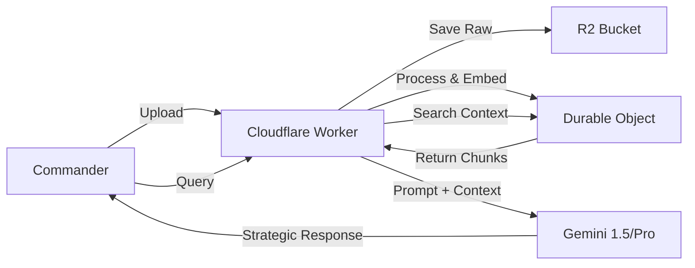

# Knowledge Base Architecture: The Master Repository

## 1. 개요 (Overview)
'지휘관 박용희'의 지식과 전략을 영구 보존하고, 엔진이 이를 실시간으로 검색하여 
의사결정에 반영할 수 있는 **'마스터 저장소(Master Repository)'** 아키텍처입니다.

## 2. 핵심 원칙 (Core Principles)
1.  **무결성 (Integrity)**: 지휘관의 원본 지식은 훼손되지 않고 R2에 원본 그대로 저장된다.
2.  **즉시성 (Immediacy)**: Durable Objects를 통해 엣지에서 즉시 검색 가능한 인덱스를 유지한다.
3.  **확장성 (Scalability)**: 벡터 임베딩과 키워드 검색을 혼합하여 대규모 지식베이스에 대응한다.

## 3. 아키텍처 설계 (Architecture Design)

### Layer 1: 원본 저장소 (Raw Storage - R2)
- **역할**: 모든 문서(Markdown, JSON, PDF 텍스트)의 원본 저장.
- **구조**:
  - `knowledge/raw/`: 원본 파일
  - `knowledge/processed/`: 청크(Chunk) 단위로 분할된 데이터

### Layer 2: 인덱스 엔진 (Index Engine - Durable Objects)
- **역할**: 실시간 검색 및 컨텍스트 주입.
- **구성**:
  - **Vector Index**: 텍스트 임베딩 벡터 저장 (Semantic Search).
  - **Keyword Index**: 중요 키워드(예: "배포", "오류") 매핑 (Lexical Search).
  - **Cache Layer**: 최근 조회된 지식을 메모리에 상주시켜 응답 속도 극대화.

### Layer 3: 추론 엔진 (Inference - Gemini)
- **역할**: 검색된 지식을 바탕으로 사용자 질문에 대한 전략적 답변 생성.
- **Flow**:
  1. 사용자 질문 수신
  2. Durable Object가 관련 지식 검색 (Retrieval)
  3. System Prompt에 검색된 지식 주입 (Augmentation)
  4. Gemini가 최종 답변 생성 (Generation)

## 4. 데이터 흐름 (Data Flow)

## 5. 구현 로드맵 (Roadmap)
- Phase 1: 정적 시스템 프롬프트에 핵심 지식 하드코딩 (현재 단계)
- Phase 2: R2 버킷 연동 및 문서 업로드 API 구축
- Phase 3: Durable Object 벡터 인덱스 구현
- Phase 4: RAG 파이프라인 완전 자동화
